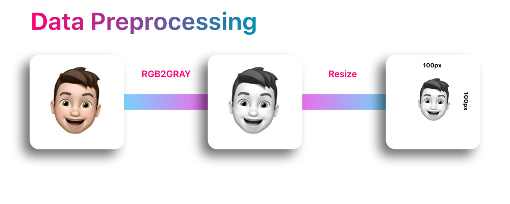
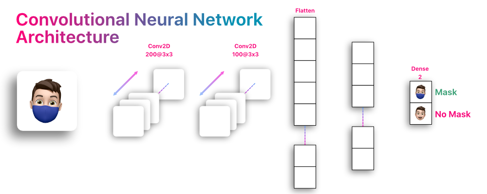
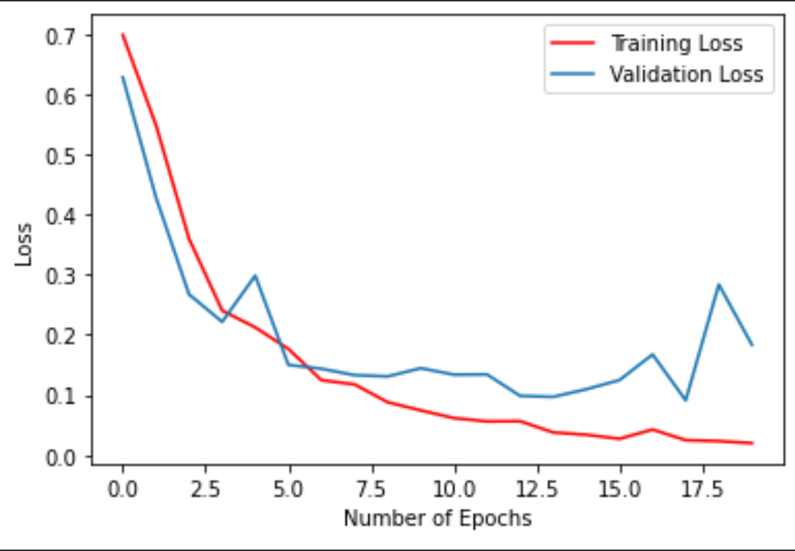
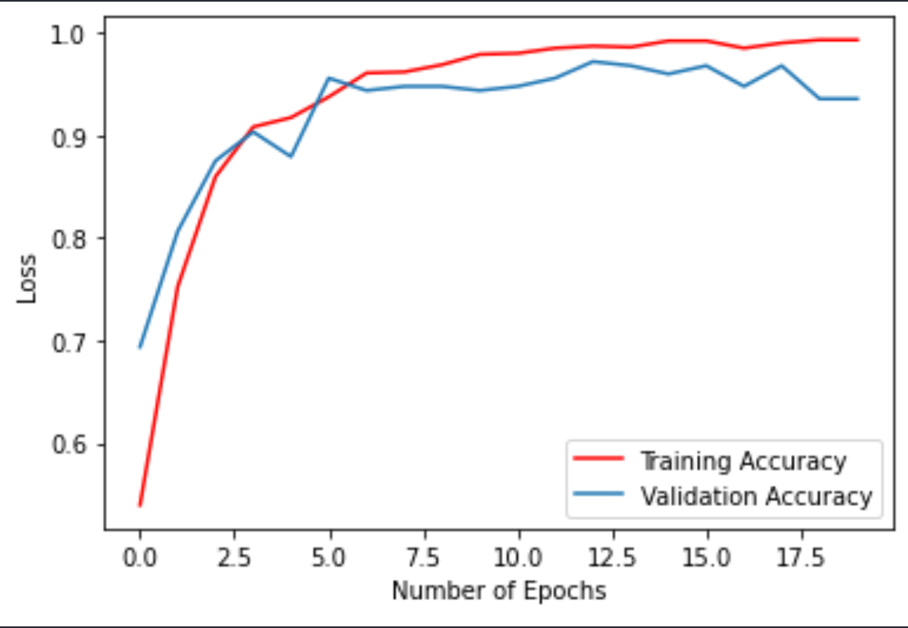

# ML Mask Detection

## Overview

## Data Preprocessing

## Neural Network

### Charts

  
   

## Acknowledgements
This project is implemented in Python using Keras, Tensorflow and OpenCV.

Huge thanks to [Prajna Bhandary](https://www.linkedin.com/in/prajna-bhandary-0b03a416a/) for such a cool dataset to work with. It's available at [Github](https://github.com/prajnasb/observations/tree/master/experiements/data)
