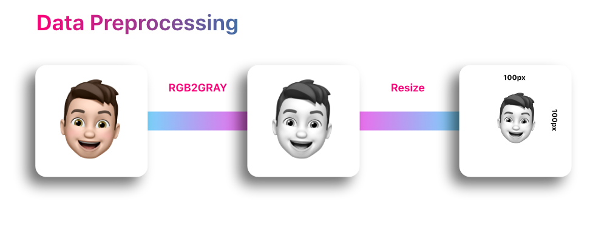

# ML Mask Detection

This was a single day exploratory project to create a model that can tell whether or not you have a face mask on. Inspired by the pandemic of 2020.
As shown above the project breakdown was simple. Use a cascade classifer to detect a face in a webcam window, extract the face and pass it to a convolutional neural network to classify the image as "no mask" or "mask".

Some data preprocessing was needed to get optimal results. To do this the images in the data set were converted to greyscale then resized to 100 by 100 pixels. Once this was done there was no need for any further processing and the data could now be passed into the neural network. 

Above is a breakdown of the models architecture. I decided to to run about 20 iterations as the acuracy improved significantly after about 5 epochs. It appears that this model could be prone to offerfitting but for the purposeses of this model, I think its okay. Below you can see the loss and accuracy charts of the model after each epoch. 

### Charts

  
   

## Acknowledgements
This project is implemented in Python using Keras, Tensorflow and OpenCV.

Huge thanks to [Prajna Bhandary](https://www.linkedin.com/in/prajna-bhandary-0b03a416a/) for such a cool dataset to work with. It's available at [Github](https://github.com/prajnasb/observations/tree/master/experiements/data)
